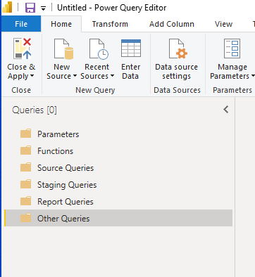

# This is my blog post from typora

## this is a heading 2 

```sql
select * from tablename
where columnname = "some value"
```

this is just some general paragraph text

> quoted block

1. ordered list #1
2. ordered list #2


here's some more text

here's an image (I hope)



and if that doesn't work, maybe this does:


what about just pasting in the image ?


